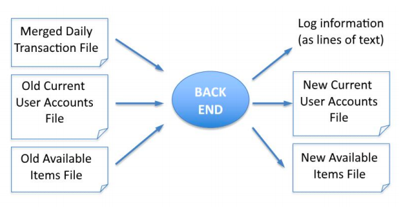
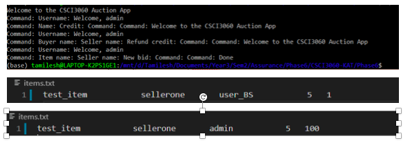

# THE BACK END

The Back End reads in the previous day’s User Accounts File and Available Items File and then applies all of the daily transactions from a merged set of daily transaction files to these files to produce a new Current User Accounts File and new Available Items File for tomorrow’s Front End runs.

  

### Back End Error Recording
- [Tests](Tests)
- [Reports](Software-Quality-Assurance-Project/Reports)

### General files:
- The Merged Daily Transaction File

# Instructions

Recommended with a **Linux** environment

The scripts are located in Software-Quality-Assurance-Project/Phase 6 directory. 
- daily.sh
- weekly.sh

The Merged Daily Transaction file is in Phase6/Logfiles/dailyLog.txt

The Items File after five daily runs is in Phase6/WeeklyItemsLog/weeklyItems.txt

# Example

  

