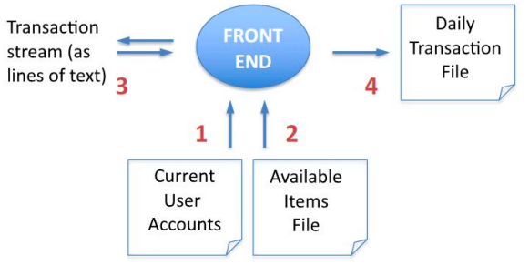

# THE FRONT END

The Front End reads in a file of items available for auction **(1)** and a file containing information regarding current user accounts in the system **(2)**, it processes a stream of item bidding and advertising transactions one at a time **(3)**, and it writes out a file of item bidding and advertising transactions at the end of the session.


<p align="center">
  
</p>

The Front End handles a sequence of transactions, each of which begins with a single transaction code (word of text) on a separate line. 

### Transaction codes:
- login - start a Front End session
- logout - end a Front End session
- create - add a user with the ability to bid/advertise items (privileged transaction)
- delete - remove a user (privileged transaction)
- advertise - put an item up for auction
- bid - make a bid on an item available for auction
- refund - issue a credit to a buyer’s account from a seller’s account (privileged transaction)
- addcredit - add credit into the system for the purchase of accounts

### General files:
- Daily Transaction File
- [Current User Accounts File](UserFile.txt)
- [Available Items File](ItemFile.txt)

# Build Instructions

This application is built using cmake. To initialize the build, from the FrontEnd directory run the command:
```cmake src```

## Windows

After running cmake, you should get a Visual Studio project that you can build.

If you run the batch file CmakeWindows.bat it will produce a UNIX makefile which you can then build with
```make```

## Linux

After running cmake, run the make command
```make```

This will output the file Auctionr to the FrontEnd directory, which is the executable for the application.

# Testing

In the Builds/phase3/Linux folder there is a copy of the test scripts packaged with the application.
These must be run on Linux as the build is made for linux.

The scripts must be run from the scripts directory: /tests/scripts
The scripts default the log file to /tests/scripts/log.txt

The test scripts are:
- test.sh
- test-all.sh
- check-log.sh
- check-all-logs.sh

## test.sh

test.sh is run in the following manner:

```./test.sh commandFolder testCaseFolder```

The script will input the inputs from the folder located at ../commandFolder/testCaseFolder, and compare
the output from the application to the output.txt also located in that folder

This script only outputs to the console. This script must be run from the scripts directory

## test-all.sh

Runs test.sh for every test case directory automatically. Will write a list of succeeded and failed cases
to /tests/logs/succeeded.txt and /tests/logs/failed.txt respectively.

If the test case fails, there will be a file formatted as commandFolder_testCaseFolder.txt which
will show the diff result between the expected and given outputs.

All the output files emptied at the beginning of this script, including /tests/scripts/files/log.txt

## check-log.sh

Takes 3 parameters, the first two are the same as test.sh, and the third is the log file
to check for an entry. An example call would be:

```./check-log.sh advertise Success ./files/log.txt```

This will check that the contents of the file ../advertise/Success/log.txt are present in
./files/log.txt.

The command will have to have been run in the application before the log file can be checked, so
it is a good idea to run ./test.sh before checking the log file.

# check-all-logs.sh

Runs ./check-log.sh for every test case folder. This script uses the log file at /tests/scripts/log.txt

The passing and failed cases will be written to /tests/logs/log_succeeded.txt and /tests/logs/log_failed.txt
respectively.
